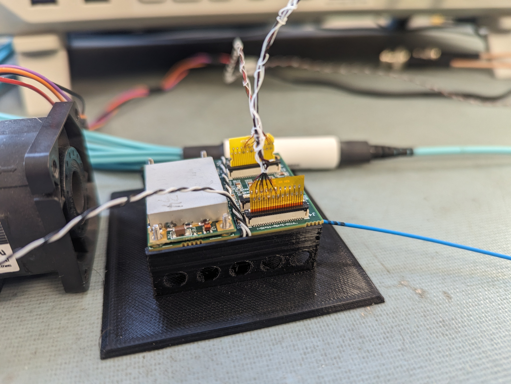

# Port Card BERT TAP0 Scan Instructions (2024 v2)

## Resources

We are using the [TrackerDAQ](https://github.com/ku-cms/TrackerDAQ) and [Ph2_ACF](https://gitlab.cern.ch/cms_tk_ph2/Ph2_ACF) frameworks to perform BERT TAP0 scans.

The TrackerDAQ repository is located here: [https://github.com/ku-cms/TrackerDAQ](https://github.com/ku-cms/TrackerDAQ).
Please see the TrackerDAQ readme for additional information, including details on installing and running the TrackerDAQ and Ph2_ACF frameworks and loading the FC7 firmware.

The Ph2_ACF repository is located here: [https://gitlab.cern.ch/cms_tk_ph2/Ph2_ACF](https://gitlab.cern.ch/cms_tk_ph2/Ph2_ACF).
The Ph2_ACF readme has information about installation and running the Ph2_ACF framework.

The FC7 firmware releases that can be used with Ph2_ACF are available here: [https://gitlab.cern.ch/cmstkph2-IT/d19c-firmware/-/releases](https://gitlab.cern.ch/cmstkph2-IT/d19c-firmware/-/releases).
You will need to use the correct version of FC7 firmware for the Ph2_ACF version and the hardware configuration that you are using.

## Login to kucms

We are using Ph2_ACF and TrackerDAQ on the kucms linux machine in Malott 4078.
The hostname is "kucms.phsx.ku.edu", and we are using the user "kucms".
If you need to use the password and do not know it, please contact Caleb Smith (caleb.smith@ku.edu) or Alice Bean (abean@ku.edu).

You can either open a terminal on the kucms desktop, or you can login remotely with ssh.
If the kucms desktop is freezing when running the terminal and/or the file explorer, please restart the kucms linux machine and try again; this should (hopefully) fix these problems.
If you still encounter problems with the kucms desktop, please contact the KU Physics IT support with details about the problem (tsc_phsx@ku.edu).

Here is the ssh command to login to kucms:
```
ssh -Y kucms@kucms.phsx.ku.edu
```

If you are using Mac or Linux, you can add this alias to your shell configuration file on your personal machine:
```
alias kucms='ssh -Y kucms@kucms.phsx.ku.edu'
```

For more details on setting up this alias, please see the TrackerDAQ readme [here](https://github.com/ku-cms/TrackerDAQ).

If you are using a Mac and encounter this error after logging into kucms with ssh:
```
Last failed login: Thu Jan  4 10:24:34 CST 2024 from 10.105.79.64 on ssh:notty
There was 1 failed login attempt since the last successful login.
Last login: Thu Jan  4 10:19:55 2024 from 10.105.79.64
perl: warning: Setting locale failed.
perl: warning: Please check that your locale settings:
	LANGUAGE = (unset),
	LC_ALL = (unset),
	LC_CTYPE = "UTF-8",
	LANG = "en_US.UTF-8"
    are supported and installed on your system.
perl: warning: Falling back to the standard locale ("C").
```
then you will need to fix this before using Ph2_ACF, as we discovered that the command to program the FC7 firmware will not work:
```
[kucms@kucms DAQSettings_v1]$ fpgaconfig -c CMSIT_RD53B_Optical_Type5_J4.xml -i IT-L8-OPTO_CROC_v4p5
04.01.2024 10:31:28: |140251851439552|I| Loading IT-L8-OPTO_CROC_v4p5 into the FPGA...
terminate called after throwing an instance of 'std::runtime_error'
  what():  Board with id 0 does not exist in file CMSIT_RD53B_Optical_Type5_J4.xml
Aborted (core dumped)
```

Please see the solution [here](https://stackoverflow.com/questions/2499794/how-to-fix-a-locale-setting-warning-from-perl), along with details in the TrackerDAQ readme [here](https://github.com/ku-cms/TrackerDAQ).

## Testing Type 5K and 5K2 e-links

For the port card BERT TAP0 scans, we use an RD53B SCC (CROCv1) with optical readout, an optical FMC, and a port card.
To test Type 5K and 5K2 e-links, there is a custom red adapter board (with jumpers) that is used to connect a display port (DP) cable on one side and the 15-pin paddle board of the e-link on the other side.

[//]: # (Port card setup images)




### Hardware setup

A display port (DP) cable should be connected between the RD53B chip (use the DP1 port) and the red adapter board.
For Type 5K and 5K2 e-links tested with the port card, we are using the "TBPIX 15 to Display Port Rev A" board that was developed in 2023.
This adapter board has two jumpers for every channel (ten jumpers in total).
The e-link channels are labeled according to the 15-pin side: CMD, D0, D1, D2, D3.

We are using the inverted polarity jumper setting for all channels:
- CMD: P -> N, N -> P
- D0:  P -> N, N -> P
- D1:  P -> N, N -> P
- D2:  P -> N, N -> P
- D3:  P -> N, N -> P

Refer to the diagram on the red adapter board for the inverted polarity "P -> N, N -> P" setting.

Note that Type 5K2 e-links have inverted polarity for CMD and D2 compared to Type 5K.
However, for Type 5K2 e-links we are accounting for these polarity inversions in the xml file using "TxPolarities" (inverts command polarity) and "RxPolarities" (inverts data polarity).
This means you should use the same jumper settings for Type 5K and 5K2.

Make sure that you are using the correct jumper settings for the channel you are testing and that the jumpers are fully inserted.
The BERT TAP0 scans have shown problems (large error rates that do not converge to 0 errors) when the jumpers have poor connection.

Finally, connect the Type 5K or 5K2 e-link that will be tested.
For both Type 5K and 5K2, the 15-pin paddle board on the e-link should connect to the red adapter board
with the notch on the left (matching the white dot) and the leads facing up.

For the orientation of the 45-pin paddle board, note that there is a difference between Type 5K or 5K2 e-links!
The best way to know the correct orientation of the 45-pin paddle board is that the leads should point away from the black bail on the Kyocera connector.
For Type 5K, the 45-pin paddle board on the e-link should connect to the port card slot J4
with the notch on the left (towards the gray DC-DC converter) and the leads away from the black bail.
For Type 5K2, the 45-pin paddle board on the e-link should connect to the port card slot J4
with the notch on the right (away from the gray DC-DC converter) and the leads away from the black bail.

The VTRX+ on the bottom of the port card should be in slot Z3.
The optical link from the VTRX+ should connect to an optical adapter
which in turn connects to an optical fiber breakout to 12 channels.
Out of these 12 optical fibers, fibers 6 and 7 should connect as a pair to the optical FMC,
which should be mounted on the FC7 in position L8.
We are connecting the fibers to bottom left position of the optical FMC, and when connected,
fiber 6 should be on the right and fiber 7 should be on the left.

### Power settings

After checking the jumper configuration/connection and the e-link connection/configuration, you can power on the FC7, port card, and RD53B chip.
There are also fans used to cool the port card and RD53B chip that should be used to prevent overheating.

We are powering the port card in constant voltage mode.
We put the power cables on one power supply output channel (on the left side of the power supply), with the white cable on positive and the black cable on negative.

For the port card, we are using constant voltage mode with these settings:
- Voltage limit: 10.16 V - should measure about 10.17 V when output is on.
- Current limit:  0.80 A - should measure about  0.16 A when output is on.

For the RD53B chip, we are using constant voltage mode with these settings on two output channels:
- Voltage limit: 1.60 V - should measure about 1.60 V when output is on.
- Current limit: 2.00 A - should measure about 0.76 A (left) and 0.40 A (right) when output is on and about 0.94 A (left) and 0.81 (right) after establishing communication.

### BERT TAP0 Scans

Commands should be run on the kucms linux machine.

This is the latest setup (from March 2024) for an RD53B SCC (CROCv1) with optical readout using an optical FMC and a port card.
We are using Ph2_ACF v4-22 and FC7 FW v4.8 for RD53B CROCv1 SCC optical readout, with the optical FMC in position L8 on the FC7 (the FMC position on the left).

Based on the port card slot (J2, J3, and J4) and the supported e-link types (1, 1K, 5, and 5K), you need to:
- Use the correct hardware connections: make sure that the VTRX+ and e-link are connected to the correct locations.
- Make sure that the e-link is connected with the correct orientation based on its type.
- Use the correct red adapter board (and jumpers) or the correct SMA cable mapping with adapter boards.
- Use the correct xml configuration file for all commands.
- Update "BERT_Scan.py" for your setup; see below for more details.

Commands should be run on the kucms linux machine.

Check that communication is working between the linux computer kucms and the FC7:
```
ping fc7 -c 3
```

Then, these setup commands should be run in a terminal on kucms.
You need to use the xml file corresponding to the port card slot, e-link type, and e-link channel that you are testing!
At the moment, only port card slot J4 is supported.
In this example, we are using port card slot J4, e-link Type 5K, and e-link channel D0,
which is why we are using the xml configuration file "CMSIT_RD53B_Optical_J4_Type5K_D0.xml".
Make sure that the FC7 is powered on before running these commands.

```
cd /home/kucms/TrackerDAQ/elink_testing_v2/Ph2_ACF
source setup.sh
cd DAQSettings_v1
fpgaconfig -c CMSIT_RD53B_Optical_J4_Type5K_D0.xml -i IT-L8-OPTO_CROC_v4p8
CMSITminiDAQ -f CMSIT_RD53B_Optical_J4_Type5K_D0.xml -r
ping fc7 -c 3
```

Then, you should run these commands to establish communication with the RD53B chip.
These two commands should be run for every e-link after the RD53B is powered on and before running a BERT TAP0 scan.
The port card and RD53B chip need to be powered on before running these commands.
```
CMSITminiDAQ -f CMSIT_RD53B_Optical_J4_Type5K_D0.xml -p
CMSITminiDAQ -f CMSIT_RD53B_Optical_J4_Type5K_D0.xml -c bertest
```

Here are other useful CMSITminiDAQ programs for reference:
```
CMSITminiDAQ -f CMSIT_RD53B_Optical_J4_Type5K_D0.xml -p
CMSITminiDAQ -f CMSIT_RD53B_Optical_J4_Type5K_D0.xml -c bertest
CMSITminiDAQ -f CMSIT_RD53B_Optical_J4_Type5K_D0.xml -c pixelalive
CMSITminiDAQ -f CMSIT_RD53B_Optical_J4_Type5K_D0.xml -c noise
CMSITminiDAQ -f CMSIT_RD53B_Optical_J4_Type5K_D0.xml -c scurve
```

Before running the BERT TAP0 scan and analysis scripts, make sure to edit these files as needed for your configuration:
- These files should be edited from the directory "/home/kucms/TrackerDAQ/TrackerDAQ/python", which is where this repository is installed.
- There are softlinks to these files in the working areas, for example in "/home/kucms/TrackerDAQ/elink_testing_v2/Ph2_ACF/DAQSettings_v1/TrackerDAQ/python".
- BERT_Scan.py: set the default TAP0 range, the "port_card_slot", and the "hardware_config" for your setup.

Here is the command to run BERT TAP0 scans:
```
python3 TrackerDAQ/python/BERT_Run_Scan.py
```

Use this script to analyze RD53B data for one e-link (specify which e-link number) or all e-links.
```
# specific e-link (specify e-link number)
./TrackerDAQ/scripts/analyze_RD53B.sh <elink_number>
# all e-links
./TrackerDAQ/scripts/analyze_RD53B.sh
```

To copy the data to your local computer, use this script from this repository:
```
./scripts/getData.sh
```
To copy the plots to your local computer, use this script from this repository:
```
./scripts/getPlots.sh
```

### Debugging Errors

If you see lpGBT errors like this for "CMSITminiDAQ" commands:
```
CMSITminiDAQ -f CMSIT_RD53B_Optical_J4_Type5K_D0.xml -p
...
|11:22:00|I|Initializing communication to Low-power Gigabit Transceiver (LpGBT): 0
|11:22:00|I|    --> Configured up and down link mapping in firmware
|11:22:00|I|LpGBT version: LpGBT-v1
|11:22:01|E|LpGBT PUSM status: ARESET
|11:22:01|E|>>> LpGBT chip not configured, reached maximum number of attempts (10) <<<
```
then you should reprogram and reset the FC7 with these commands, which usually fixes the issue:
```
fpgaconfig -c CMSIT_RD53B_Optical_J4_Type5K_D0.xml -i IT-L8-OPTO_CROC_v4p5
CMSITminiDAQ -f CMSIT_RD53B_Optical_J4_Type5K_D0.xml -r
```
Then, you should repeat the "CMSITminiDAQ" command to re-establish communication:
```
CMSITminiDAQ -f CMSIT_RD53B_Optical_J4_Type5K_D0.xml -p
```
If you still have communication problems, then you can turn off the RD53B chip and the port card, reprogram and reset the FC7, and then turn the RD53B chip and port card on.

Similarly, if you see lpGBT errors like this when running the BERT_Run_Scan.py python script:
```
python3 TrackerDAQ/python/BERT_Run_Scan.py
...
Running BERT with TAP0=200
Running BERT with TAP0=210
terminate called after throwing an instance of 'Exception'
  what():  [RD53lpGBTInterface::WriteReg] LpGBT register writing issue
  ./TrackerDAQ/scripts/PortCard_BERT_Scan.sh: line 54: 25469 Aborted                 (core dumped) CMSITminiDAQ -f CMSIT_RD53B_Optical_BERT_Custom.xml -c bertest > "$dataDir/scan.log"
```
then you should reprogram and reset the FC7 with these commands, which usually fixes the issue:
```
fpgaconfig -c CMSIT_RD53B_Optical_J4_Type5K_D0.xml -i IT-L8-OPTO_CROC_v4p5
CMSITminiDAQ -f CMSIT_RD53B_Optical_J4_Type5K_D0.xml -r
```
Then, you should re-establish communication with this command before trying the scan again:
```
CMSITminiDAQ -f CMSIT_RD53B_Optical_J4_Type5K_D0.xml -p
```
